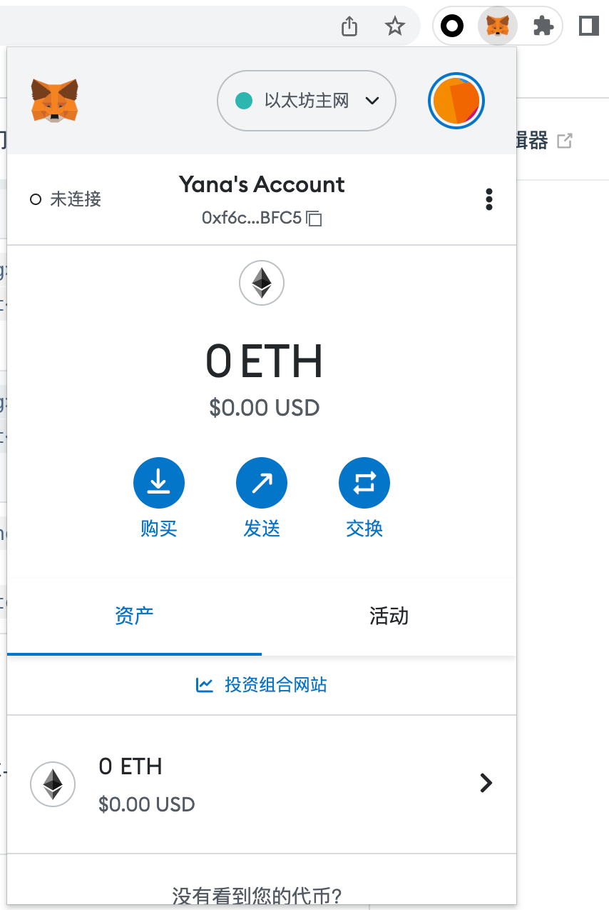

本系列学习是参考 <https://learnweb3.io> 。
由于 web3 能找到的中文教程比较少，所以笔者边学习边进行翻译总结。希望在这之中可以巩固知识，加强理解。

# 地址
地址是使用密码学生成的一串文本，代表一个区块链上的帐户。可以从钱包地址发送和接收资金。基本上，`地址 = 帐户`。这个就是一个以太坊地址：0xf6cFA99513532b9D2E65f4dF1fD7F51cad00BFC5。

# 私钥

私钥是地址的对应物。每个地址都有一个关联的私钥。私钥需要严格保密而不与任何人共享，相当于你的密码，来证明你对地址的所有权。

任何拥有私钥的人都可以从你的地址向他们的地址汇款。

私钥看起来像这样：E9873D79C6D87DC0FB6A5778633389F4453213303DA61F20BD67FC233AA33262

**_注意：由于区块链是分散的，因此没有“忘记密码”选项。如果丢失了私钥，将无法访问帐户。同样，如果有人偷了你的私钥，盗走了你的资金，你也无能为力。确保私钥的安全非常重要。_**

# 助记词

助记词 = 密码中的密码

加密钱包有点像密码管理器，您可以在其中管理多个区块链帐户。如果私钥是单个帐户的密码，则助记词有点像该钱包的主密码。

当你创建一个新的加密钱包时，你会看到一个助记词，你需要绝对安全的记住它。

如果您创建了一个钱包，然后在其中创建了 5 个帐户，您的助记词将管理所有 5 个帐户。如果您想切换到一个新钱包，您可以通过使用它们各自的私钥，或者只使用种子短语导入来分别导入这 5 个钱包，它会重新生成相同的 5 个帐户。

种子短语的一个例子是：dove lumber quote board young robust kit invite plastic regular skull history

# 加密钱包

加密钱包允许你与去中心化应用程序交互，并允许通过钱包连接到 DApp，充当构建在区块链上的所有应用程序的单点登录。

# 设置钱包

对于以太坊，有许多可用的钱包选项。最容易上手且对开发人员最友好的是 Metamask 或 Coinbase 钱包。我个人使用的是 Metamask。
你可以从<https://metamask.io/download/>来下载安装 Metamask。

我使用的是 Chrome 插件

到此你就可以开始进行一些交易啦～
